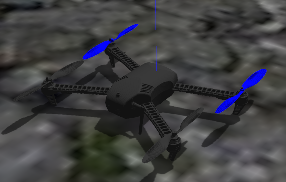
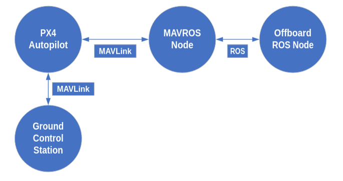

# MAVROS Offboard ROS Tutorial

<!-- This Project contains my hopes and dreams. Please, save them. -->
This project contains the code for offboard control made using the ROS/MAVROS tutorial found on PX4 website's.




<!-- Do your best! I will try, README template, I will try. -->
<!-- I hope its understandable -->

## Dependencies

To use the code in this repository, certain dependencies and third-party programs are needed. The code was tested on <em>Ubuntu 20.04</em>.
```
# Instalation of PX4 with all its dependencies
git clone https://github.com/PX4/PX4-Autopilot.git --recursive

# Setup of PX4 on Ubuntu [Able to be used for simulation purposes]
bash ./PX4-Autopilot/Tools/setup/ubuntu.sh

# Instalation of MAVROS
sudo apt-get install ros-${ROS_DISTRO}-mavros ros-${ROS_DISTRO}-mavros-extras ros-${ROS_DISTRO}-mavros-msgs

# GeographicLib datasets needed for QGroundControl
wget https://raw.githubusercontent.com/mavlink/mavros/master/mavros/scripts/install_geographiclib_datasets.sh
sudo bash ./install_geographiclib_datasets.sh 
```
Restart the computer upon compleation.

The only ground control station tested with the code is QGroundControl, since it uses MAVLink. It can be downloaded from the following link: <a href="https://d176tv9ibo4jno.cloudfront.net/latest/QGroundControl.AppImage" target="_blank" rel="noreferrer">QGroundControl.AppImage</a>.

## Usage

For the usage of this package, the user must follow the following steps on the described order.
```
#These commands can be executed in any order

# Ground control station
./QGroundControl.AppImage

# Launch of the MAVROS node with loopback IP and ROS port
roslaunch mavros px4.launch fcu_url:="udp://:14540@127.0.0.1:14557"
```

The next commands are needed to start PX4 and ready Gazebo to simulate the drone. These commands should be ran in the PX4-Autopilot clone folder downloaded from dependencies.
```
DONT_RUN=1 make px4_sitl_default gazebo-classic
source ~/catkin_ws/devel/setup.bash
source Tools/simulation/gazebo-classic/setup_gazebo.bash $(pwd) $(pwd)/build/px4_sitl_default
export ROS_PACKAGE_PATH=$ROS_PACKAGE_PATH:$(pwd)
export ROS_PACKAGE_PATH=$ROS_PACKAGE_PATH:$(pwd)/Tools/simulation/gazebo-classic/sitl_gazebo-classic
roslaunch px4 posix_sitl.launch
```
It is advised to make a .sh file to store these commands since they are needed everytime you want to open Gazebo on a new terminal. In my case, these commands are stored on <b><em>px4_smlt.sh</em></b>.
```
bash px4_smlt.sh
```
Last of all, the repository code should be on ~/catkin_ws/src and should be compiled before its intended use.
```
rosrun mavrostutorial node
```

## Docker && Dockerfile

If you want to build a docker image with this code that contains everything necessary for its use, it is posible using the following command on <b>mavrostutorial</b> folder.
```
docker build -t braismtnez/final .
```
To use said docker image, run the following command. Te program should show on startup.
```
docker run -it --rm --privileged --net=host --volume /tmp/.X11-unix:/tmp/.X11-unix:rw --volume $XAUTHORITY:$XAUTHORITY --env QT_X11_NO_MITSHM=1 --env DISPLAY=$DISPLAY --env XAUTHORITY=$XAUTHORITY braismtnez/final
```

## Diving Deeper

- https://docs.px4.io/main/en/ros/mavros_offboard_cpp.html 
- https://docs.px4.io/main/en/simulation/ros_interface.html 

## Reach Out

Brais Martínez -> bmartinez.ext@catec.aero 

<!--
This is an html comment 

Plans that I dont want showing up:

- This
- That

-->